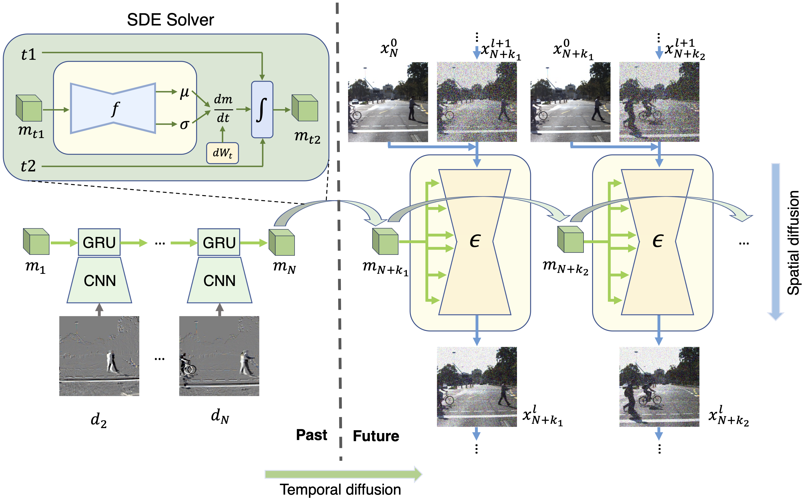

# STDiff: Spatio-temporal diffusion for continuous stochastic video prediction</h1>
[arXiv link](https://arxiv.org/abs/2312.06486) | code from the [author](https://github.com/XiYe20/STDiffProject)

## Overview
<p align="center">

</p>

## Installation
1. Install the custom diffusers library
```bash
git clone https://github.com/XiYe20/CustomDiffusers.git
cd CustomDiffusers
pip install -e .
```
2. Install the requirements of STDiff
```bash
pip install -r requirements.txt
```

## Dataset

Folder Structure \
  &nbsp;&nbsp;&nbsp;&nbsp; test/ \
  &nbsp;&nbsp;&nbsp;&nbsp;&nbsp;&nbsp;&nbsp;&nbsp; example_0/ \
  &nbsp;&nbsp;&nbsp;&nbsp;&nbsp;&nbsp;&nbsp;&nbsp;&nbsp;&nbsp;&nbsp; 0000.png \
  &nbsp;&nbsp;&nbsp;&nbsp;&nbsp;&nbsp;&nbsp;&nbsp;&nbsp;&nbsp;&nbsp; 0001.png \
  &nbsp;&nbsp;&nbsp;&nbsp;&nbsp;&nbsp;&nbsp;&nbsp;&nbsp;&nbsp;&nbsp; ... \
  &nbsp;&nbsp;&nbsp;&nbsp;&nbsp;&nbsp;&nbsp;&nbsp; example_1/ \
  &nbsp;&nbsp;&nbsp;&nbsp;&nbsp;&nbsp;&nbsp;&nbsp;&nbsp;&nbsp;&nbsp; 0000.png \
  &nbsp;&nbsp;&nbsp;&nbsp;&nbsp;&nbsp;&nbsp;&nbsp;&nbsp;&nbsp;&nbsp; 0001.png \
  &nbsp;&nbsp;&nbsp;&nbsp;&nbsp;&nbsp;&nbsp;&nbsp;&nbsp;&nbsp;&nbsp; ... \
  &nbsp;&nbsp;&nbsp;&nbsp;&nbsp;&nbsp;&nbsp;&nbsp; example_... \
&nbsp;&nbsp;&nbsp;&nbsp; train/ \
  &nbsp;&nbsp;&nbsp;&nbsp;&nbsp;&nbsp;&nbsp;&nbsp; example_0/ \
  &nbsp;&nbsp;&nbsp;&nbsp;&nbsp;&nbsp;&nbsp;&nbsp;&nbsp;&nbsp;&nbsp; 0000.png \
  &nbsp;&nbsp;&nbsp;&nbsp;&nbsp;&nbsp;&nbsp;&nbsp;&nbsp;&nbsp;&nbsp; 0001.png \
  &nbsp;&nbsp;&nbsp;&nbsp;&nbsp;&nbsp;&nbsp;&nbsp;&nbsp;&nbsp;&nbsp; ... \
  &nbsp;&nbsp;&nbsp;&nbsp;&nbsp;&nbsp;&nbsp;&nbsp; example_... 

## Training and Evaluation
The STDiff project uses accelerate for training. The training configuration files and test configuration files for different datasets are placed inside stdiff/configs.

### Training
1. Check train_script.sh, modify the visible gpus, num_process, select the correct train_cofig file
2. Training
```bash
. ./train_script.sh
```

### Test
1. Check test_script.sh, select the correct test_cofig file
2. Test
```bash
. ./test_script.sh
```